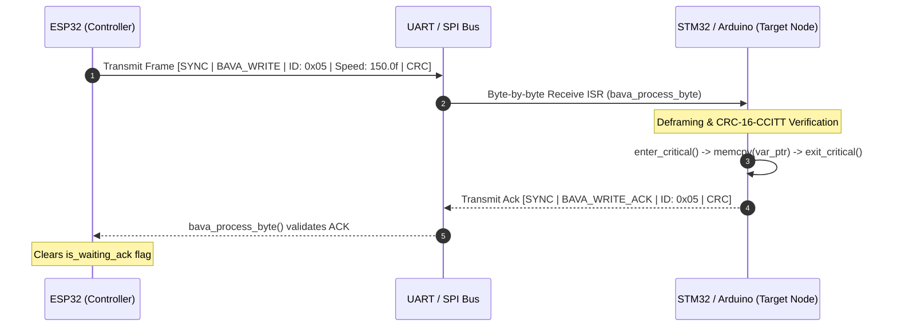

# BAVA Protocol

> A lightweight, zero-allocation, asynchronous Object Dictionary communication protocol designed for memory-constrained microcontrollers over UART and SPI.

[](https://components.espressif.com/components/nishanthraj707/bava/versions/1.0.1/readme)
[](https://www.arduino.cc/reference/en/libraries/bava-protocol/)
[](https://opensource.org/licenses/Apache-2.0)
[](https://en.wikipedia.org/wiki/C99)
[](https://docs.espressif.com/projects/esp-idf/)
[](https://www.st.com/)
[](https://www.arduino.cc/)
[](#key-features)
[](performance.md)

---

### ⚔️ BAVA vs. Standard ASCII UART

| Benchmark Metric | Standard ASCII UART | BAVA Protocol | Performance Advantage |
| :--- | :--- | :--- | :--- |
| **RX Parse Latency (Receiver)** | Up to 251 µs ($O(N)$ scaling) | **~80 µs ($O(1)$ constant time)** | **Up to 68% Faster RX Parsing** |
| **TX Framing Latency (Sender)** | 33 µs (Unprotected `snprintf`) | **84 µs (Full CRC-16 Framing)** | **Full Payload Protection** |
| **Data Integrity / Drops** | ~50% Data Loss ("ghost cycles") | **100% Delivery Success** | **Zero Data Corruption** |
| **Dynamic Memory Footprint** | 0 Bytes | **0 Bytes ($O(1)$ Memory)** | **Zero Memory Leaks / Fragmentation** |

---
## 📦 Bava Protocol Package Repositories & Registries

| Ecosystem | Registry / Documentation | Installation / Quick Start |
| :--- | :--- | :--- |
| **Espressif IDF** | [](https://components.espressif.com/components/nishanthraj707/bava/versions/1.0.1/readme?language=en) |`idf.py add-dependency "nishanthraj707/bava"`|
| **Arduino IDE** | [](https://www.arduino.cc/reference/en/libraries/bava-protocol/) | `Arduino IDE > Library Manager > "Bava Protocol"` |

## 🚀 Why BAVA? (Protocol Comparison)

Inter-microcontroller communication often forces developers to choose between complex, heavy protocols or fragile, hand-rolled custom framing. BAVA bridges this gap by providing an **Object Dictionary architecture** specifically optimized for bare-metal, Arduino framework targets, and real-time operating systems (FreeRTOS, Zephyr).

| Feature | Raw UART / Custom Framing | Modbus RTU | CANopen / Micro-CAN | Protocol Buffers / CBOR | **BAVA Protocol** |
| :--- | :---: | :---: | :---: | :---: | :---: |
| **Dynamic Memory (`malloc`)** | Minimal | None | Rare | High (Heap reliant) | **Zero (0 Bytes)** |
| **Packet Deframing & Stuffing** | Manual / Bug-prone | Silent byte gaps | Fixed 8-byte frames | Length-delimited | **Automatic (0x7D Byte-Stuffing)** |
| **ISR & Thread Synchronization** | Manual locks | None built-in | Complex OS wrappers | None | **Built-in Critical Sections** |
| **Memory Sync Overhead** | High custom parsing | Address mapping | Index/Subindex lookup | Schema parsing | **Direct $O(1)$ Pointer Sync** |
| **CRC Data Integrity** | Optional / Ad-hoc | CRC-16-MODBUS | CRC-15 | None / Higher layer | **Built-in CRC-16-CCITT** |
| **Non-Blocking Ack Timeout** | None | Blocking / Serial | Complex timer stack | N/A | **Built-in Systick Engine** |

---

## ⚡ Key Features

* 🧠 **Zero Dynamic Memory Allocation**: Pure static C implementation operating without a single `malloc()` or `free()`, protecting RTOS task stacks and embedded heaps.
* 🎯 **Fast Object Dictionary Routing**: Direct mapping between variable memory pointers and unique 8-bit IDs for fast payload matching and updates.
* 🔒 **ISR-Safe Memory Synchronization**: Configurable `enter_critical` / `exit_critical` hardware lock callbacks and native Arduino `noInterrupts()`/`interrupts()` eliminate torn reads and data races between hardware ISRs and application threads.
* 🌐 **Endian-Independent Wire Format**: Standardized bit-shift serialization ensures seamless cross-platform payload transport between Little-Endian (ESP32) and Big-Endian targets.
* ⏱️ **Non-Blocking Timeout Engine**: Integrated state machine timer (`bava_tick()`) tracks unacknowledged frame timeouts without blocking application loops or RTOS execution contexts.

---

## 📊 Benchmark Metrics & Empirical Profiling

Official real-time hardware profiling data, microsecond execution latency measurements, dynamic heap allocation tracking, and physical signal integrity validation are documented in **[performance.md](performance.md)** and the comprehensive benchmark evaluation report in **[report.md](report.md)**.

* 🎓 **Empirical Validation**: Benchmarks empirically validated in the **Department of Instrumentation and Control Engineering at PSG College of Technology**.
* ⚡ **RX Parse Latency ($O(1)$ Routing)**: Standard ASCII UART string parsing takes up to **251 µs** (135.5 µs mean) and scales $O(N)$ with multiple variables; BAVA routes in **$O(1)$ constant time (73.1 µs – 80.2 µs, averaging ~80 µs)**.
* ⏱️ **TX Framing Latency**: Standard ASCII `snprintf` takes **33 µs** with zero payload protection; BAVA takes **84 µs** (and **64.56 µs** for minimal frames) to construct a fully byte-escaped, CRC-16 verified binary frame.
* 🛡️ **Data Integrity (0% Loss)**: Standard asynchronous UART string parsing suffers a **50% data-drop failure rate** due to fragmented hardware buffers ("ghost cycles"); BAVA achieves a **100% success rate** using state-machine reconstruction and CRC-16-CCITT validation.
* 🧠 **Zero Dynamic Memory Footprint**: BAVA consumes **exactly 0 bytes of dynamic heap allocation** during continuous transmission and reception.
* 🧱 **Minimal Stack Usage**: Under **96 Bytes** stack high-water mark.

| Metric | Raw ASCII UART | BAVA Protocol | Performance Advantage |
| :--- | :--- | :--- | :--- |
| **RX Parse Latency (Receiver)** | Up to 251 µs ($O(N)$ scaling) | **~80 µs ($O(1)$ constant time)** | **Up to 68% Faster RX Parsing** |
| **TX Framing Latency (Sender)** | 33 µs (Unprotected `snprintf`) | **84 µs (Full CRC-16 Framing)** | **Full Payload Protection** |
| **Data Integrity / Drops** | ~50% Data Loss (Ghost Cycles) | **100% Delivery Success** | **Zero Data Corruption** |
| **Dynamic Heap Footprint** | 0 Bytes | **0 Bytes ($O(1)$ Memory)** | **Zero Memory Leaks** |

See the complete empirical validation summary in **[performance.md](performance.md)** and full benchmark test logs in **[report.md](report.md)**.

---

## 🏗️ How It Works (Visual Architecture)

BAVA uses a **Shared Object Dictionary** architecture. Local variables (integers, floats, structs) are registered with unique 8-bit IDs. When a host sends a packet, BAVA deframes the byte stream on-the-fly inside a receive interrupt or polling loop, validates the CRC-16 checksum, locks the memory region using hardware critical section callbacks, updates the destination memory directly via `memcpy`, and sets a flag for the application layer.



---

## 📦 Packet Structure

All BAVA packets enforce byte-stuffing (`0x7D` escape character, XOR `0x20`) on header command, ID, length, payload, and CRC bytes to guarantee synchronization bytes (`0xAA 0x55`) never appear within packet contents.

| Offset (Bytes) | Field Name | Size (Bytes) | Description |
| :---: | :--- | :---: | :--- |
| `0` | **SYNC1** | `1` | Primary Synchronization Byte (`0xAA`) |
| `1` | **SYNC2** | `1` | Secondary Synchronization Byte (`0x55`) |
| `2` | **CMD** | `1` | Command (`0x01`: READ, `0x02`: WRITE, `0x81`: READ_RESP, `0x82`: WRITE_ACK) |
| `3` | **ID** | `1` | Object Dictionary Variable ID (`0x00` – `0x1F`) |
| `4` | **LEN** | `1` | Payload Length ($0 \le \text{LEN} \le 255$) |
| `5 .. (5+N)` | **PAYLOAD** | $N$ | Raw binary data payload ($N = \text{LEN}$) |
| `5+N+1` | **CRC1** | `1` | CRC-16-CCITT Checksum (Low Byte) |
| `5+N+2` | **CRC2** | `1` | CRC-16-CCITT Checksum (High Byte) |

---

## 📑 API Overview

| Identifier | Type | Description |
| :--- | :--- | :--- |
| `bava_handle_t` | `struct` | Main instance context handle storing state machine tracking, variable dictionary, buffers, and hardware callbacks. |
| `bava_init()` | Function | Initializes state machine parameters, dictionary structures, and transmission callback pointer. |
| `bava_register_var()` | Function | Binds a target variable memory address and byte size to a specific 8-bit dictionary ID. |
| `bava_process_byte()` | Function | Non-blocking state machine parser for incoming stream bytes (safe inside UART/SPI ISRs). |
| `bava_send_write()` | Function | Fetches the current dictionary value for a given ID and transmits a formatted BAVA_WRITE frame. |
| `bava_send_raw_write()` | Function | Transmits raw payload buffer data from a specified user memory pointer to a remote dictionary ID. |
| `bava_send_read()` | Function | Formats and transmits a BAVA_READ request frame for a remote dictionary variable ID. |
| `bava_tick()` | Function | Advances system timestamp for non-blocking timeout tracking and triggers error callbacks on dropped ACKs. |
| `bava_var_updated()` | Function | Returns `true` if a registered dictionary variable received new validated data since last status clear. |
| `bava_var_clear_update_status()` | Function | Resets the update flag for a given dictionary ID after reading the value. |

---

## 🛠️ Installation & Setup

### Installation

**For ESP-IDF:**
```bash
idf.py add-dependency "nishanthraj707/bava"
```

**For Arduino:**
Search for "Bava Protocol" in the Arduino IDE Library Manager.

### Arduino IDE / PlatformIO Integration
For Arduino IDE or PlatformIO projects (AVR, ESP8266, ESP32, STM32duino):
1. Copy `bava.h` and the `src/` files into your project's `src/` directory or `libraries/BAVA/`.
2. Define or let the Arduino build framework automatically pass `-DARDUINO`.
3. BAVA automatically maps `noInterrupts()`/`interrupts()` for critical sections, atomic locks with `yield()` for TX protection on boards like ESP8266/ESP32, and `millis()` for timestamp tracking.

### ESP-IDF Component Integration
To manually clone into your project's `components/` directory:

```bash
cd my_esp32_project/components
git clone https://github.com/NishanthRaj707/bavaprotocol.git bava
```

Ensure your application's `main/CMakeLists.txt` registers the dependency:
```cmake
idf_component_register(
    SRCS "main.c"
    INCLUDE_DIRS "."
    REQUIRES bava
)
```

### CMake / Generic C Projects (STM32, Bare-Metal, Linux Host)
Add the source files and include directory directly in your build script:

```cmake
add_subdirectory(bavaprotocol)
target_link_libraries(my_app PRIVATE bava)
```

---

## 🚀 Cross-Platform Quick Start (ESP-IDF UART Example)

Below is a complete production example showing how to integrate BAVA into ESP-IDF with a dedicated UART RX task, hardware transmission callback (`uart_write_bytes`), hardware timer ticks (`esp_log_timestamp()`), and hardware critical section locking.

```c
#include <stdio.h>
#include <stdint.h>
#include <stdbool.h>
#include "freertos/FreeRTOS.h"
#include "freertos/task.h"
#include "driver/uart.h"
#include "esp_log.h"

// Bava protocol header file
#include "bava.h"

#define UART_PORT_NUM      UART_NUM_1
#define TXD_PIN            (17)
#define RXD_PIN            (16)
#define BUF_SIZE           (1024)

static const char *TAG = "BAVA_APP";

// Bava instance
static bava_handle_t bava;

// Registered Target Dictionary Variables
static float motor_speed_rpm = 0.0f;
static uint32_t sensor_status_flags = 0;

// 1. Hardware Transmission Callback (ESP-IDF UART TX Wrapper)
void esp32_uart_tx_cb(uint8_t *data, uint16_t size) {
    uart_write_bytes(UART_PORT_NUM, (const char *)data, size);
}

// 2. Hardware Critical Section Callbacks for ISR Safety
static portMUX_TYPE bava_spinlock = portMUX_INITIALIZER_UNLOCKED;

void esp32_enter_critical(void) {
    taskENTER_CRITICAL(&bava_spinlock);
}

void esp32_exit_critical(void) {
    taskEXIT_CRITICAL(&bava_spinlock);
}

// 3. Error Callback for dropped packets / timeout events (Optional)
void bava_error_handler(uint8_t id, uint8_t error_code) {
    ESP_LOGE(TAG, "Timeout / Error on Variable ID 0x%02X (Code: 0x%02X)", id, error_code);
}

// 4. Dedicated UART Receive Task (Processes Incoming Byte Stream)
static void uart_rx_task(void *arg) {
    uint8_t rx_buf[128];
    while (1) {
        int rx_bytes = uart_read_bytes(UART_PORT_NUM, rx_buf, sizeof(rx_buf), pdMS_TO_TICKS(10));
        for (int i = 0; i < rx_bytes; i++) {
            // Process incoming byte through BAVA state machine
            bava_process_byte(&bava, rx_buf[i]);
        }

    }
}

void app_main(void) {
    // Configure UART Peripheral
    const uart_config_t uart_config = {
        .baud_rate = 115200,
        .data_bits = UART_DATA_8_BITS,
        .parity    = UART_PARITY_DISABLE,
        .stop_bits = UART_STOP_BITS_1,
        .flow_ctrl = UART_HW_FLOWCTRL_DISABLE,
        .source_clk = UART_SCLK_DEFAULT,
    };
    uart_driver_install(UART_PORT_NUM, BUF_SIZE * 2, 0, 0, NULL, 0);
    uart_param_config(UART_PORT_NUM, &uart_config);
    uart_set_pin(UART_PORT_NUM, TXD_PIN, RXD_PIN, UART_PIN_NO_CHANGE, UART_PIN_NO_CHANGE);

    // Initialize BAVA instance
    bava_init(&bava, esp32_uart_tx_cb);
    bava.enter_critical = esp32_enter_critical;
    bava.exit_critical  = esp32_exit_critical;
    bava.error_callback = bava_error_handler;

    // Advance BAVA non-blocking timer using ESP-IDF system timestamp API
    bava_tick(&bava, (uint32_t)esp_log_timestamp());    

    // Register Object Dictionary Variables
    bava_register_var(&bava, 0x01, &motor_speed_rpm, sizeof(motor_speed_rpm));
    bava_register_var(&bava, 0x02, &sensor_status_flags, sizeof(sensor_status_flags));

    ESP_LOGI(TAG, "BAVA Protocol Stack online. Listening on UART %d...", UART_PORT_NUM);

    // Create RX Processing Task
    xTaskCreate(uart_rx_task, "bava_rx_task", 4096, NULL, 10, NULL);

    // Main Control Loop
    while (1) {
        // Check if remote node updated motor speed
        if (bava_var_updated(&bava, 0x01)) {
            ESP_LOGI(TAG, "Updated Motor Speed Target: %.2f RPM", motor_speed_rpm);
            bava_var_clear_update_status(&bava, 0x01);
        }

        // Periodically transmit raw sensor status flags (ID 0x02)
        sensor_status_flags++;
        bava_send_raw_write(&bava, 0x02, (const uint8_t *)&sensor_status_flags, sizeof(sensor_status_flags));

        vTaskDelay(pdMS_TO_TICKS(1000));
    }
}
```

---

## 📄 License

This project is licensed under the Apache License Version 2.0 - see the [LICENSE](LICENSE) file for details.

---

## ❓ Frequently Asked Questions (FAQ)

### Q1: Why is BAVA superior to JSON, CSV, or raw ASCII string parsing over UART in embedded microcontrollers?
Text-based serial protocols (JSON, CSV, `printf`/`sscanf`) require dynamic string formatting and CPU-intensive parsing functions like `strtof()` or dynamic JSON parsers. These functions scale poorly ($O(N)$ time complexity, taking up to 251 µs per frame) and risk severe embedded heap fragmentation by invoking `malloc()` and `free()`. Furthermore, raw ASCII streams suffer up to a **50% data-drop failure rate ("ghost cycles")** due to UART FIFO buffer fragmentation across line delimiters (`\n`). BAVA operates in **$O(1)$ constant time (~80 µs RX parsing)**, uses **0 bytes of dynamic heap allocation**, and employs byte-stuffed state-machine deframing with 16-bit CRC-16-CCITT validation to guarantee **100% data delivery success**.

### Q2: How does BAVA's Object Dictionary Finite State Machine (FSM) handle multi-variable routing without heap memory?
BAVA binds local variable memory pointers (integers, floats, structs) to unique 8-bit Object Dictionary IDs during initialization via `bava_register_var()`. When an incoming stream byte arrives, BAVA's non-blocking FSM (`bava_process_byte()`) deframes the binary frame on-the-fly inside receive interrupts or polling loops. Upon validating the CRC-16 checksum, BAVA acquires ISR-safe hardware critical section locks (`enter_critical`/`exit_critical`) and copies the payload directly into the target variable memory address via `memcpy`. This direct memory pointer synchronization bypasses string search algorithms and schema decoding entirely, achieving deterministic $O(1)$ routing.

### Q3: Is BAVA suitable for real-time, deterministic industrial control loops across different microcontrollers and RTOS environments?
Yes. BAVA is an open-source (FOSS) C99 protocol licensed under Apache-2.0, specifically engineered for mission-critical industrial control loops. It provides native build system integrations for **Zephyr RTOS Modules**, **ESP-IDF Components**, **STM32 Bare-Metal (HAL/LL)**, and the **Arduino Framework**. BAVA's sub-100 µs execution latency (84 µs TX framing, ~80 µs RX parsing), non-blocking systick ACK engine (`bava_tick()`), and under-96-byte task stack footprint were empirically profiled and validated on inter-chip hardware links (STM32 Cortex-M3 to ESP32 Dual-Core) in the **Department of Instrumentation and Control Engineering at PSG College of Technology**.

